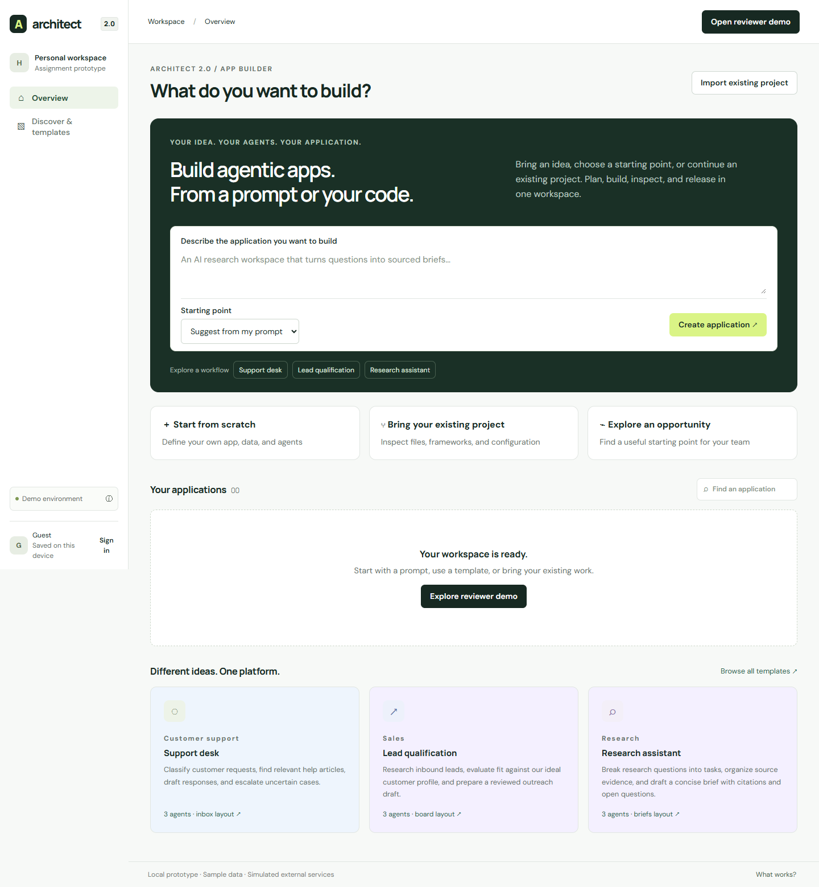

# Architect 2.0 — An app-building workspace for any domain

A live, general-purpose agentic app-builder prototype for Lyzr's Technical Product Manager assignment. Business users and developers work on the same project through guided and technical views.

**[Open Architect 2.0](https://architect-2-hardik-bhatt.aihardikbhatt.chatgpt.site)** · **[Public GitHub repository](https://github.com/adminthelinkai/lyzr-architect-2-tpm)**



## Build different applications

Start with a prompt, choose a blueprint, or import an existing project's manifest. Support, sales, research, and hiring have independent agent roles, sample records, knowledge requirements and layouts. A blank custom app lets you define your own workflow. EPC quality is one optional example.

- Configure the app heading, record labels, 1–8 custom fields and 2–5 workflow stages.
- Switch between inbox, board and brief layouts; the preview changes immediately.
- Add, edit and remove agent roles with instructions, input/output contracts and tools.
- Add records, search them, change stages and assign human review.
- Review chat/configuration changes across interface, agents and connections; apply or undo.
- Inspect framework contracts, import diagnostics, GitHub conflicts, release checks, failures and rollback.

The prompt-to-blueprint mapping is deterministic. Unknown ideas start with an empty custom app rather than inheriting an unrelated domain. This is a functional UI/UX prototype, not arbitrary AI code generation.

## Review in five minutes

1. Describe a sales-lead app on the homepage. Approve its plan and build its board.
2. Create a research app. Observe its different agents, content and brief layout.
3. Select **Start from scratch**. Define your app's fields/stages in **App structure**, add an agent, build and add a record.
4. Request **Add Teams alerts**. Review Change impact, apply and undo. Connect sample knowledge/Teams, run tests, release and recover from a failed health check.
5. Import the research manifest. In technical view, inspect files and framework contracts, edit configuration, resolve a GitHub conflict and release.

[Demo script](docs/DEMO-SCRIPT.md) · [Evidence](docs/EVIDENCE.md) · [Research](docs/RESEARCH.md) · [Rationale](docs/PRODUCT-RATIONALE.md) · [Application answers](docs/APPLICATION-ANSWERS.md) · [Interview preparation](docs/INTERVIEW-PREP.md) · [Verification](docs/VERIFICATION.md)

## Run and verify

Requires Node.js 20+. The app has no runtime dependencies.

```sh
npm start
# http://localhost:4173
npm ci
npm run check
npm test
npm run build
# With the server running and Google Chrome installed:
node verification/render.mjs
node verification/platform.mjs
node verification/accessibility.mjs
```

`dist/` contains authored static HTML, CSS and JavaScript. Build validates the release; it does not compile source. Deploy `dist/` using the included Sites manifest. Hash routes require no server rewrite.

## Real behavior and explicit boundaries

| Working locally | Simulated | Deferred |
| --- | --- | --- |
| Multiple projects, editable app/agent structure, distinct previews, record creation/stages/search, validation, persistence, config/contract inspection, impact/undo, release gates, snapshots, rollback, JSON export | Demo identity, generation progress, model runs, external connections, Studio reuse, GitHub sync, invitations, internal app release | Server authentication, cloud database, arbitrary repository cloning, executable framework adapters, model inference, document ingestion, realtime collaboration |

The **Architect website itself is live**. Releasing an app inside the workspace is a labeled simulation. Passing sample tests validates deterministic rules, not model accuracy. All supplied records and sources are fictional.

State stays in this browser under `architect2.workspace.v1`; existing EPC projects are preserved by migration. Export saves JSON and contracts, not a standalone executable app. Export re-import is not supported. Clearing browser data removes local projects.

## Source map

- `dist/blueprints.js`: distinct domain starting points and blank custom configuration.
- `dist/state.js`: validated transitions, migration, impact, contracts and release readiness.
- `dist/app.js`: routes, forms, dialogs, previews and persistence.
- `dist/styles.css`: responsive workspace, inbox, board and brief layouts.
- `tests/`: domain invariants and actual form journeys.
- `verification/`: isolated Chrome checks, machine-readable results and screenshots.
- `scripts/serve.mjs`: dependency-free loopback static server.

Current-product research is bounded by documented access limits; exhaustive Architect parity is not claimed. No customer interviews, outcomes, personal achievements or production model results have been invented. See [handoff](docs/HANDOFF.md).
