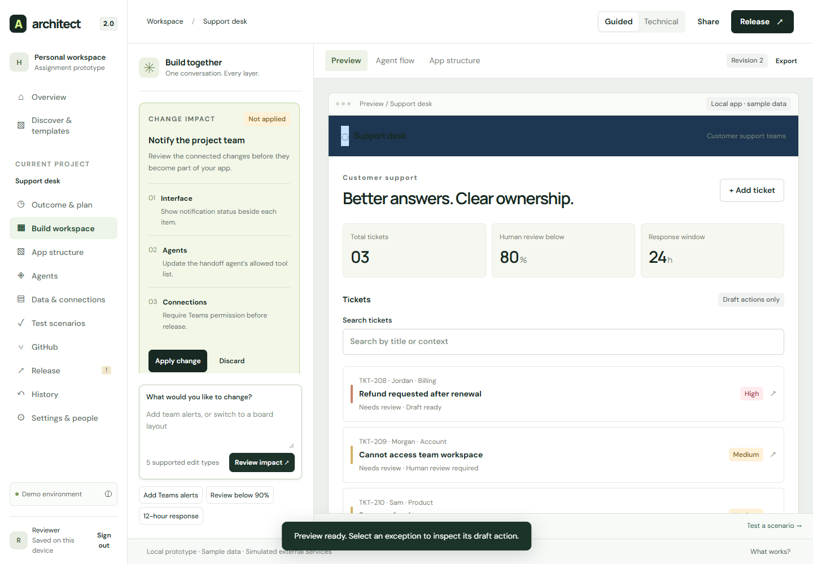

# Architect 2.0 — Shared intent, inspectable change

A Technical Product Manager assignment prototype for Lyzr. **Sitewise**, a fictional EPC quality-exception application, is the sample app built inside the platform.

The distinctive interaction is **Change impact**: review a request across the interface, agent behavior, and connection requirements, apply it to shared project state, and undo it. Guided and technical views use the same project revision.

**[Open the live prototype](https://architect-2-hardik-bhatt.aihardikbhatt.chatgpt.site)** · **[Public GitHub repository](https://github.com/adminthelinkai/lyzr-architect-2-tpm)**



## Run locally

Requires Node.js 20 or newer. The application has no runtime dependencies.

```sh
npm start
# Open http://localhost:4173
```

To install development tools and verify:

```sh
npm ci
npm run check
npm test
npm run build
# With the local server running and Google Chrome installed:
node verification/render.mjs
```

`dist/` contains authored HTML, CSS, and JavaScript. The build command validates the static release; there is no compilation step. Deploy `dist/` to a static host. Hash routes work without a server rewrite. A Sites hosting manifest is provided.

## Review in five minutes

1. Select **Open reviewer demo**. Approve the outcome plan and build the preview.
2. In chat, request **Add Teams alerts**. Inspect Change impact, apply, then undo.
3. Open **Data & connections**. Grant sample quality-knowledge and Teams permissions.
4. Run the release suite. Choose a failing release, recover, then inspect release history.
5. Return to Overview → **Import project** → Load sample repository. Switch between guided and technical views, edit configuration, inspect GitHub conflicts, and release.

[Full demo script](docs/DEMO-SCRIPT.md) · [Evidence matrix](docs/EVIDENCE.md) · [Research](docs/RESEARCH.md) · [Product rationale](docs/PRODUCT-RATIONALE.md) · [Application answers](docs/APPLICATION-ANSWERS.md) · [Interview preparation](docs/INTERVIEW-PREP.md) · [Verification](docs/VERIFICATION.md)

## What is real, simulated, or deferred?

| Real browser behavior | Deterministic simulation | Deferred |
| --- | --- | --- |
| Navigation, forms, validation, project state, local persistence, preview interactions, configuration, impact review, undo, history, release gates, snapshots, rollback, JSON export | Demo identity, plan/app generation, agent execution, external credentials/permissions, Studio reuse, GitHub sync, team invitations, deployment of the sample app | Server authentication, cloud database, arbitrary repository clone, real framework adapters, model inference, document ingestion, realtime collaboration |

The **Architect prototype itself** is an ordinary hostable website. The **sample application's deployment flow inside it** is simulated. Passing sample tests validates prototype rules, not model accuracy. All exception records and procedures are fictional. No secret or password entry is required.

Project data stays in this browser under `architect2.workspace.v1`. Clearing browser data loses it. Settings → Export project saves a JSON snapshot. Reset clears this prototype's local data only. Export re-import is not currently supported.

## Source map

- `dist/state.js`: immutable domain transitions, import validation, change proposals, derived contracts, release readiness.
- `dist/app.js`: route rendering, forms, accessible native dialogs, event handling, device-local persistence.
- `dist/styles.css`: design tokens, workspace and sample-app surfaces, responsive layouts, focus and motion preferences.
- `tests/state.test.mjs`: state invariants and failure recovery.
- `tests/journeys.test.mjs`: both journeys through a DOM environment.
- `verification/render.mjs`: real Chrome journey and viewport checks; screenshot evidence in the same folder.
- `scripts/serve.mjs`: dependency-free local static server, loopback only, with path traversal protection.

## Scope and limitations

The prompt input records any outcome, but the generated example is a bounded EPC workflow. Chat supports notifications, threshold, response-window, and title edits. Unsupported requests explain the boundary and preserve input. Framework choices are configuration contracts, not a promise of executable compatibility. The vendor template reuses the quality-inbox shell and sample records; it is not a separate domain implementation.

The current Architect capability inventory comes from official documentation, with access limitations recorded. No interviews, customer outcomes, performance benchmarks, or personal achievements have been invented. See `docs/HANDOFF.md` for final publishing status and remaining submission steps.
